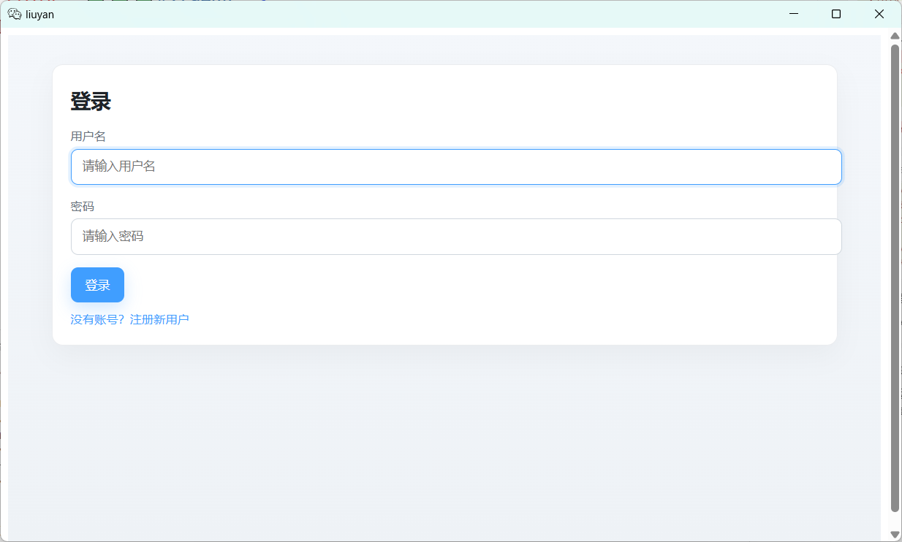
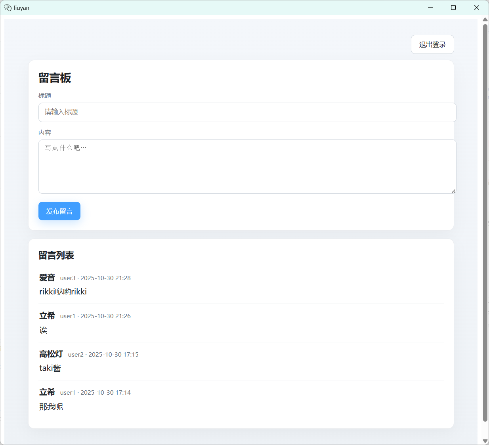

# Electron 桌面留言板

一个基于 Vue3 + Electron 构建的跨平台桌面应用，支持本地与云端 MySQL 数据存储，实现了完整的用户认证与留言管理功能。

[](https://vuejs.org/)
[](https://electronjs.org/)
[](https://mysql.com/)

## ✨ 特性

- 🖥 **跨平台桌面端**: 使用 Electron 构建，支持 Windows, macOS, Linux。
- ⚡ **现代技术栈**: 基于 Vite + Vue3 (Composition API)，开发热重载，构建迅速。
- 🔐 **用户系统**: 完整的用户注册、登录与登出功能。
- 💬 **留言管理**: 发布、查看留言列表，支持实时展示。
- 💾 **数据持久化**: 支持本地 MySQL 或云端 RDS，数据不丢失。
- 🔄 **多端同步**: 多个客户端可连接同一数据库，实现数据共享。
- 🛡 **安全策略**: 生产环境内置“首次运行配置”与系统凭据库存储密码（keytar），避免明文泄露；内置 CSP。
- 📦 **一键打包**: 使用 electron-builder 生成 NSIS 等标准安装包。

## 📸 截图

| 登录界面 | 留言板主界面 |
| :---: | :---: |
|  |  | 


## 🚀 快速开始

### 环境要求

- Node.js >= 18.0
- MySQL >= 5.7 (本地安装或使用云数据库)

### 安装与运行

1.  **克隆项目**
    ```bash
    git clone https://github.com/hongwei1532/LiuYanBan.git
    cd LiuYanBan
    ```

2.  **安装依赖**
    ```bash
    npm install
    # 首次使用“首次运行配置”需依赖 keytar（生产/开发都建议安装）
    npm install keytar dotenv --save
    ```

3.  **数据库配置**
    - 在您的 MySQL 中创建一个数据库（例如 `liuyan`）。
    - 导入数据库表结构 [`/sql/init.sql`](./sql/init.sql)。

4.  **启动开发模式**
    ```bash
    npm run dev
    ```
    - 开发模式下，Electron 主进程会 fork 内置后端。

### 构建与打包
生成生产环境的安装包：

```bash
npm run build
```

- 首次启动安装包时，会弹出“数据库配置”窗口：
  - 主机/用户名/数据库名 → 保存到用户数据目录配置文件（Windows：`%APPDATA%/liuyan/config.json`）。
  - 密码 → 保存到系统凭据库（Windows Credential Manager / macOS Keychain / Linux Secret Service），通过 keytar 读写。
- 主进程在 fork 后端服务时，将配置注入为环境变量（`DB_HOST/DB_USER/DB_PASSWORD/DB_NAME`）。

### 安全注意事项
- 如需要重置配置：删除用户数据目录下的 `config.json`，并在系统凭据库删除服务名 `liuyan-db` 的条目，重启应用即可再次进入首次配置。

### 📄 开源许可
本项目基于  [MIT license](https://opensource.org/licenses/MIT) 开源。

重要声明：本项目为个人学习研究作品，禁止用于任何商业及非法用途。